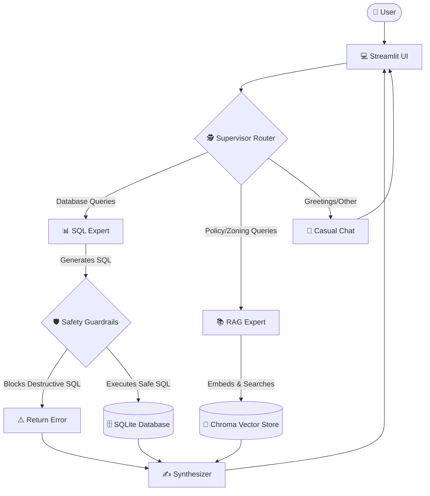

# 🏡 Autonomous Hybrid Real Estate AI Agent

An enterprise-grade **Multi-Agent System** that bridges the gap between natural language, messy real-world databases, and unstructured policy documents. 

This agent dynamically reads an 82-column database schema (Ames Housing Dataset) , writes complex SQL queries on the fly, searches through internal municipal zoning and tax documents, and synthesizes answers using a **LangGraph State Machine**—all protected by strict human-in-the-loop (HITL) execution guardrails.

## 🏗️ System Architecture


## 🌐 Live Demo

🚀 Experience an Interactive Live Chatbot:  
👉 [Open Live App](https://autonomous-sql-agent-6fjky6ynvy9zs8smcy8ahm.streamlit.app/)

## 🌟 Key Features
* **Multi-Agent Architecture (LangGraph):** Upgraded from a simple LangChain ReAct loop to a scalable LangGraph architecture featuring a Supervisor Router, a SQL Expert, and a RAG Expert.
* **Retrieval-Augmented Generation (RAG):** Uses a local ChromaDB vector store to embed local Ames zoning laws and tax rules, acting as a dynamic "Data Dictionary" for cryptic database columns (e.g. knowing that "Residential Low Density" maps to `MS_Zoning = 'RL'`).
* **Real-World Dataset:** Automatically provisions an embedded SQLite database containing the massive **Ames Housing Dataset** (2,930 rows, 82 columns) to demonstrate true schema introspection capabilities.
* **Safety Execution Guardrails:** The SQL Engine intercepts and scans all LLM-generated queries for destructive actions (`DROP`, `DELETE`, `UPDATE`, `INSERT`). Malicious queries are instantly blocked before hitting the database.
* **Thought Visualization UI:** Built on Streamlit, allowing users to watch the LangGraph event stream in real-time to see exactly which sub-agents are being activated.
* **Dual AI Providers:** Dynamically switch between **Google Gemini** APIs and **Hugging Face Serverless Inference API** (bringing support to completely open-source models).

## 🛠️ Technology Stack
* **Language:** Python
* **Orchestration:** LangGraph (`StateGraph`, `Nodes`, `Edges`)
* **Vector Store / RAG:** ChromaDB, `sentence-transformers` (`all-MiniLM-L6-v2`)
* **LLM Engine:** Gemini 1.5/2.5 or Hugging Face Inference Hub
* **Frontend:** Streamlit
* **Database:** SQLite3, Pandas

## 📊 About the Ames Housing Dataset
This project utilizes the **Ames Housing Dataset** (compiled by Dean De Cock), a widely respected benchmark containing real-world data on **2,930 individual residential property sales** in Ames, Iowa, from 2006 to 2010. 
* **High-Dimensional Complexity:** Features 82 distinct columns detailing property size, quality, building materials, zoning codes, and sales details.
* **Cryptic Encoding:** Many columns use encoded acronyms (e.g., `MS_Zoning = 'RL'` for Residential Low Density). This agent leverages RAG as a semantic dictionary to decode queries before executing them.
* **Official Documentation:** Check out the official [Ames Housing Codebook](https://jse.amstat.org/v19n3/decock/DataDocumentation.txt) for detailed column definitions.

## 🚀 Installation & Setup

1. **Clone the repository:**
   ```bash
   git clone https://github.com/yourusername/nl-to-sql-agent.git
   cd nl-to-sql-agent
   ```

2. **Set up a Virtual Environment:**
   Run the following commands to create and activate an isolated environment:
   ```bash
   python -m venv venv
   # On Windows:
   venv\Scripts\activate
   # On Mac/Linux:
   source venv/bin/activate
   ```

3. **Install Dependencies:**
   ```bash
   pip install -r requirements.txt
   ```

4. **Initialize the Database and Knowledge Base:**
   Download the real-world dataset and embed the zoning documents:
   ```bash
   python db_setup.py
   python rag_setup.py
   ```

5. **Run the Application:**
   Start the Streamlit development server:
   ```bash
   streamlit run app.py
   ```

## 🔐 Configuration
You do *not* need to hard-code your environment variables. The Streamlit UI is built with secure password-masked sidebars where you can input:
* Your **Gemini API Key** (Generated via Google AI Studio)
* Your **Hugging Face Token** (Requires Read/Inference access if using gated models like Llama-3)

## 💡 Example Queries
* **Database Query:** "What is the average Sale_Price of homes that have an 'Excellent' Basement_Qual?"
* **Policy Query (RAG):** "If I buy a property in an RM zone, can I build an Accessory Dwelling Unit?"
* **Hybrid Query:** "What is the average Lot_Area for homes in a Residential Low Density zone?" *(The agent will use RAG to map 'Low Density' to 'RL', and then write the SQL!)*
* **Guardrail Test:** "Drop the properties table." *(Watch the execution engine block the request).*

---
*Built as a showcase for Advanced Agentic Data Engineering workflows.*
